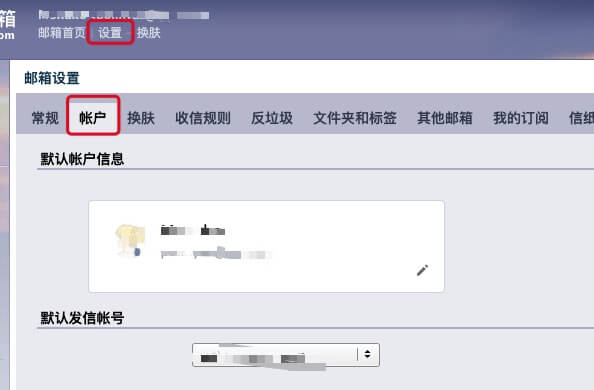
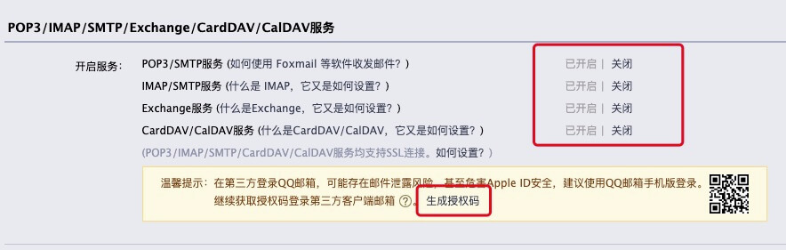

# Java实现邮件发送功能

> 使用的 jar：==mail-1.5.0-b01.jar==、==activation-1.1.1.jar==

#### 获取授权码：QQ邮箱





#### 发送邮件的工具类

```java
import javax.activation.DataHandler;
import javax.activation.FileDataSource;
import javax.mail.*;
import javax.mail.internet.*;
import java.util.Date;
import java.util.Enumeration;
import java.util.Properties;
import java.util.Vector;
/**
 * 邮件发送工具类
 * @author monako
 * @Date   2019年11月22日 上午11:31:41
 */
public class MailUtil {
    String host = "smtp.qq.com";            // SMTP 服务器名，可以从 QQ 邮箱的帮助文档查到 文档地址：https://service.mail.qq.com/cgi-bin/help?subtype=1&no=167&id=28
    int port = 587;                         // SMTP 服务器端口号，可以从 QQ 邮箱的帮助文档查到端口为 465 或 587
    String from = "";        								// 发件人邮箱地址
    String username = "";    								// 发件人用户名
    String password = "";   								// 发件人密码
    String to = "";                         // 收件人邮箱地址
    String filename = "";                   // 附件文件名
    String subject = "";                    // 邮件主题
    String content = "";                    // 邮件正文
    Vector<String> file = new Vector<String>();             // 附件文件集合
    public void setPort(int port) { this.port = port; }
    public MailUtil() {}
    public MailUtil(String to, String from, String smtp, int port,
                    String username, String password, String subject, String content) {
        this.to = to;
        this.from = from;
        this.host = smtp;
        this.port = port;
        this.username = username;
        this.password = password;
        this.subject = subject;
        this.content = content;
    }
    public MailUtil(String to, String subject, String content) {
        this.to = to;
        this.subject = subject;
        this.content = content;
    }
    public void setHost(String host) { this.host = host; }
    public void setPassWord(String pwd) { this.password = pwd; }
    public void setUserName(String usn) { this.username = usn; }
    public void setTo(String to) { this.to = to; }
    public void setFrom(String from) { this.from = from; }
    public void setSubject(String subject) { this.subject = subject; }
    public void setContent(String content) { this.content = content; }
    /**
     * @param strText
     * @return
     * @Description: 把主题转为中文 utf8
     * @author monako
     * @Date   2019年11月22日 上午12:32:27
     */
    public String transferChinese(String strText) {
        try {
            strText = MimeUtility.encodeText(new String(strText.getBytes(), "utf-8"), "utf-8", "B");
        } catch (Exception e) {
            e.printStackTrace();
        }
        return strText;
    }

    public void attachfile(String fname) { file.addElement(fname); }

    /**
     * @return
     * @Description: 发送邮件，发送成功返回true 失败false
     * @author monako
     * @Date   2019年11月22日 上午13:32:47
     */
    public boolean sendMail() {
        // 构造mail session
        Properties props = new Properties();
        // 连接协议
        props.put("mail.transport.protocol", "smtp");
        // SMTP 服务器名
        props.put("mail.smtp.host", host);
        // 是否需要身份验证
        props.put("mail.smtp.auth", "true");
        // SMTP 服务器端口号
        props.put("mail.smtp.port", port);
        // 是否使用 SSL 安全连接
        // props.put("mail.smtp.ssl.enable", "true");
        // 是否输出控制台信息
        // props.put("mail.debug", "true");
        Session session = Session.getDefaultInstance(props,
                new Authenticator() {
                    public PasswordAuthentication getPasswordAuthentication() {
                        return new PasswordAuthentication(username, password);
                    }
                });

        try {
            // 构造MimeMessage 并设定基本的值
            MimeMessage msg = new MimeMessage(session);
            msg.setFrom(new InternetAddress(from));

            msg.setRecipients(Message.RecipientType.BCC, InternetAddress.parse(to));
            subject = transferChinese(subject);
            msg.setSubject(subject);

            // 构造Multipart
            Multipart mp = new MimeMultipart();

            // 向Multipart添加正文
            MimeBodyPart mbpContent = new MimeBodyPart();
            mbpContent.setContent(content, "text/html;charset=utf-8");

            // 向MimeMessage添加（Multipart代表正文）
            mp.addBodyPart(mbpContent);

            // 向Multipart添加附件
            Enumeration<String> efile = file.elements();
            while (efile.hasMoreElements()) {

                MimeBodyPart mbpFile = new MimeBodyPart();
                filename = efile.nextElement().toString();
                FileDataSource fds = new FileDataSource(filename);
                mbpFile.setDataHandler(new DataHandler(fds));
                String filename = new String(fds.getName().getBytes(), "ISO-8859-1");

                mbpFile.setFileName(filename);
                // 向MimeMessage添加（Multipart代表附件）
                mp.addBodyPart(mbpFile);

            }

            file.removeAllElements();
            // 向Multipart添加MimeMessage
            msg.setContent(mp);
            msg.setSentDate(new Date());
            msg.saveChanges();

            // 发送邮件
            Transport transport = session.getTransport("smtp");
            transport.connect(host, username, password);
            transport.sendMessage(msg, msg.getAllRecipients());
            transport.close();
        } catch (Exception mex) {
            mex.printStackTrace();
            return false;
        }
        return true;
    }
}
```

#### 使用

```java
// 发送邮件
MailUtil sendmail = new MailUtil("邮箱", "标题", "正文");
// 添加附件
sendmail.attachfile("附件地址");
// 邮件发送成功返回 true
boolean isMail = sendmail.sendMail();
```

