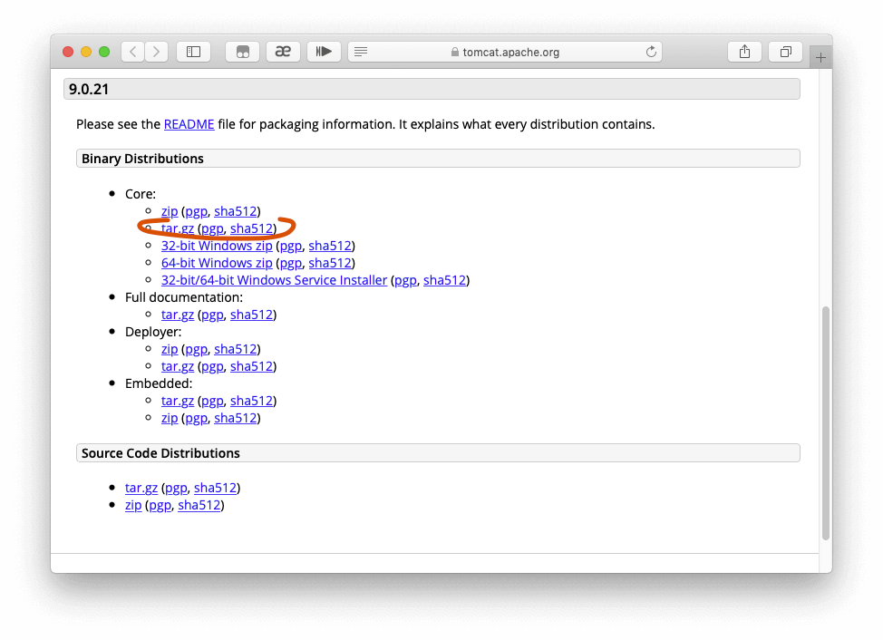

[TOC]

# XML & Tomcat学习笔记

## XML

> extensible markup language 可扩展的标记语言，倒状树形结构

### 作用

1. __保存数据__
2. __做配置文件__
3. __数据传输载体__

### 定义

> 就是一个.xml格式的文件

#### 文档声明

version：解析这个xml时，使用什么版本的解析器
encoding：解析xml中文字的时候，使用的编码
standalone：no - 该文档会依赖关联其它文档，yes - 这是一个独立的文档

```xml
<?xml version="1.0" encoding="UTF-8" standalone="no"?>
<stu>
  <name>monako</name>
</stu>
```

#### encoding详解

> 在解析这个xml的时候，使用什么编码去解析。	— 	解码

电脑上的文件在保存的时候并不是真正的储存文字,而是存储这些文字对应的二进制，根据文件使用的编码，来得到

默认文件保存的时候，使用的是GBK的编码保存

__让xml正常显示中文__

1. 让encoding也是gbk，或者gb2312
2. 如果encoding是utf-8，那么保存文件的时候耶必须使用utf-8
3. 保存的时候见到的ansi，对应的其实是我们的本地编码gbk

==为了通过，建议使用utf-8保存，以及encoding都是utf-8==

### 元素定义

> 其实就是里面的标签

1. 根标签：文档声明下第一个元素
2. 标签可以嵌套
3. 空标签
4. 标签自定义
5. 命名规则：
   1. 可以含有字母，数字，以及其它字符
   2. 不能以数字或者标点符号开始
   3. 不能以字符'xml'（或者XML、Xml）开始
   4. 不能包含空格
   5. 尽量简单，知名知义

### 简单元素 & 复杂元素

* 简单元素

> 元素里面包含了普通文字

* 复杂元素

> 元素里面还可以嵌套其他的元素

### 属性定义

> 定义在元素的里面

```xml
 <name id="10086"></name>
```

### CDATA区

* __非法字符__

> 严格来讲，xml中只有"<"和"&"是非法的，省略号、引号和大于号是合法的，但是用他们替换为实体引用是个好习惯
>
> < ------- &lt

__如果字符串里面有过多的字符，包含了类似标签或关键字，不想让xml的解析器去解析，那么可以使用CDATA来包装__

==通常在服务器给客户端返回数据的时候==

```xml
<![CDATA[ 不会解析这里面的内容 ]]>
```

### XML解析

> 其实就是获取元素里面的字符或属性数据

==常用的两种解析方式==

* __DOM__

> document object model把警个xml全部读到内存当中,形成树状结构。整个文档称之为document对象 ，属性对应Attribute对象，所有的元素节点对应Flement对象，文本也可以称之为Text对象，以上所有对象都可以称之为Node节点，如果xml特别大，那么会造成内存溢出

* __SAX__

> Simple API for Xml 基于事件驱动，读一行，解析一行，不会造成内存溢出
>
> 不能进行增删，只能查询

#### 解析API

> 针对以上两种解析方式，给出的解决方案

1. __jaxp__    ==sun公司，操作繁琐==
2. __jdom__
3. __dom4j__     ==使用比较广泛==

#### Dom4j的基本用法

__element.elements()__

__element.element("")__

1. __创建SAX读取对象__
2. __指定解析的xml资源__
3. __得到元素__
4. __根据相应元素获取子元素 或 根据相应元素获取所有子孙元素__

```java
public class MainTest {
    public static void main(String[] args) {
        try {
            // 创建SAX读取对象
            SAXReader saxReader = new SAXReader(); // jdbc ---- classloader
            // 指定解析的xml资源
            Document document = saxReader.read(new File("src/xml/dao.xml"));
            // 得到元素
            // String name = document.getName(); //文件路径及文件名
            Element element = document.getRootElement();
            // 获取根元素下面的子元素的value
            // String s = element.element("name").getStringValue();
            // 获取根元素下面的所有子元素的value
            List<Element> elementList = element.elements();
            for (Element s: elementList) {
                String name = s.getText();
                System.out.println(name);
            }
        }catch (Exception e){
            e.printStackTrace();
        }
    }
}
```

```xml
<?xml version="1.0" encoding="UTF-8" standalone="no"?>
<stu>
    <name>撒下</name>
    <age>18</age>
    <sex>1</sex>
</stu>
```

#### Dom4j的Xpath使用

> dom4j支持xpath的写法，xpath就是xml的路径语言，支持我们在解析xml时，能够快速定位到具体的第一个元素

1. 添加jar包依赖 ==jaxen-1.1-beta-6.jar==
2. 在查找指定节点的时候，更具xpath语法规则来查找
3. 后续代码和之前一样

```java
// 使用Xpath，还得添加支持的jaxen-1.1-beta-6.jar，获取的是第一个，只返回一个
Element nameElement = (Element) rootElement.selectSingleNode("//name");
System.out.println(nameElement.getText());
// 获取文档中所有name元素
List<Node> elementList = rootElement.selectNodes("//name");
for (Node e:elementList) {
  System.out.println(e.getText());
}
```

### XML约束

#### DTD

> __语法自成一派，早起就出现的，可读性比较差__

__写法：__

1. 网络引入

```xml
<?xml version="1.0" encoding="UTF-8"?>
<!-- 文档类型 标签名 网络上的dtd dtd名称 dtd路径 -->
<!DOCTYPE stus PUBLIC "//UNKNOWN/" "unknown.dtd">
```

2. 本地引入

```xml
<!-- 本： 文档类型 标签名 本地 dtd路径-->
<!DOCTYPE stus SYSTEM "stus.dtd">
```

3. 嵌入式约束

```xml
<!-- 嵌入式dtd约束 -->
<!DOCTYPE stus [
        <!ELEMENT stus (stu)> ：stus下面有一个元素stu，但是只有一个
        <!ELEMENT stu (name,age)> ：stu下面有两个元素name，age，顺序必须name--age
        <!ELEMENT name (#PCDATA)> ：
        <!ELEMENT age (#PCDATA)>
				<!ATTLIST stu id CDATA #IMPLIED> ：stu有一个属性，文本类型，改属性可有可无
        ]>
```

__元素的个数__

| 表示符 |    解释    |
| :----: | :--------: |
|   +    | 一个或多个 |
|   *    | 零个或多个 |
|   ?    | 零个或一个 |

__属性的类型定义__

> CDATA：属性是普通文字
>
> ID：属性值必须唯一

__声明属性__

__语法：__ \<!ATTLIST ==元素名称== ==属性== ==属性类型== ==默认值==>

#### Schema

> __其实就是个xml，使用xml语法，解析方便，是为了代替DTD,但是Schema约束内容比DTD还多，所以还没真正代替DTD__

__约束文档：__

```xml
<?xml version="1.0" encoding="UTF-8" ?>
<!-- xmls：名称/空间
     targetNamespace：目标名称空间，下面定义的元素都与这个名称空间绑定
     elementFormDefault：元素的格式化情况 -->
<schema xmlns="http://www.w3.org/2001/XMLSchema"
        targetNamespace="http://blog.monako.com/teacher"
        elementFormDefault="qualified">
    <element name="teachers">
        <complexType>
            <!--  maxOccurs：元素出现的最大次数  -->
            <sequence maxOccurs="2">
                <!--  这是一个复杂元素  -->
                <element name="teacher">
                    <!--  这是用于声明这个元素是复杂元素  -->
                    <complexType>
                        <sequence>
                            <!--  以下两个是简单元素  -->
                            <element name="name" type="string"></element>
                            <element name="age" type="int"></element>
                        </sequence>
                    </complexType>
                </element>
            </sequence>
        </complexType>
    </element>
</schema>
```

__实例文档：__

```xml
<?xml version="1.0" encoding="UTF-8" ?>
<!--    xmlns:xsi：这里必须这样写
        xmlns：名称空间，固定写法，写的是schema里面的顶部目标名称空间
        xsi:schemaLocation：前面是名称空间 后面是xsd文件路径-->
<teachers
        xmlns:xsi="http://www.w3.org/2001/XMLSchema-instance"
        xmlns="http://blog.monako.com/teacher"
        xmlns:bb="http://blog.monako.com/teacher"
        xsi:schemaLocation="http://blog.monako.com/teacher teacher.xsd"
>
    <teacher>
        <bb:name>张三</name>
        <age>21</age>
    </teacher>
    <teacher>
        <name>张三</name>
        <age>21</age>
    </teacher>
</teachers>
```

__空间名称的作用：__

 ​	一个xml如果想指定它的约束规则，假设使用的是DTD， 那么这个xml只能指定一个DTD，不能指定多个DTD，但是如果一个xml的约束是定义在schema里面，并且是多个schema，那么是可以的。__简单的说：__ 一个xml可以引用多个schema约束。但是只能引用一个DTD约束。名称空间的作用就是在写元素的时候,可以指定该元表使用的是哪一套约束规则。默认情况下, 如果只有一套规则，那么都可以这么写。

## 程序架构

* C / S (client / server)

> ==QQ== ==WeChat== ==LOL==
>
> __优点：__ 部分代码写在客户端，用户体验好
>
> __缺点：__ 服务器更新，客户端也要更新

* B / S (browser / server)

> ==网页游戏==
>
> __优点：__ 客户端只要有浏览器就行，占用资源小，不用更新
>
> __缺点：__ 用户体验不好

## Tomcat

### 安装和使用

* [下载安装](https://tomcat.apache.org/download-90.cgi)



* 解压到 /usr/local/

* 配置环境变量 vim .bash_profile

```shell
export PATH=${PATH}:/usr/local/Tomcat目录/bin
```

* source .bash_profile (使用刚才更新之后的内容)
* 授权bin目录下的所有操作

```shell
sudo chmod 755 *.sh
```

* 启动

```shell
startup.sh
```

* 关闭

```shell
shutdown.sh
```

### Tomcat目录介绍

__bin：__ 包含以下jar、bat、sh文件

__conf：__ Tomcat配置

__lib：__ Tomcat依赖

__logs：__ 日志

__temp：__ 临时文件

__webapps：__ 发布到Tomcat服务上的项目

__work：__ jsp翻译成class文件存放地

### 叭项目发布到Tomcat服务中

* __方式一：__ 拷贝到webapp/ROOT下 或 在webapps下新建一文件夹放置项目
* __方式二：__ 配置虚拟路径

> 1. 使用==conf/server.xml==中，找到==Host==元素节点
>
> 2. 加入以下内容：
>
>    ```xml
>    <!-- docBase: 项目的路径地址
>         path: 对应的虚拟地址 一定要以 / 开头
>         对应的访问方式：http://localhost:8080/monako/启动文件 -->
>    <Context docBase="/Users/monako/Documents/Monako/dist" path="/monako"></Context>
>    ```

* __方式三：__ 配置虚拟路径

  1. 在==conf/Catalina/localhost/==下新建xml文件，名字自定
  2. 在文件里写入

  ```xml
  <?xml version="1.0" encoding="UTF-8"?>
  <Context docBase="项目的路径地址"></Context>
  <!-- 访问方式：http://localhost:8080/新建的xml文件名/启动文件 -->
  ```