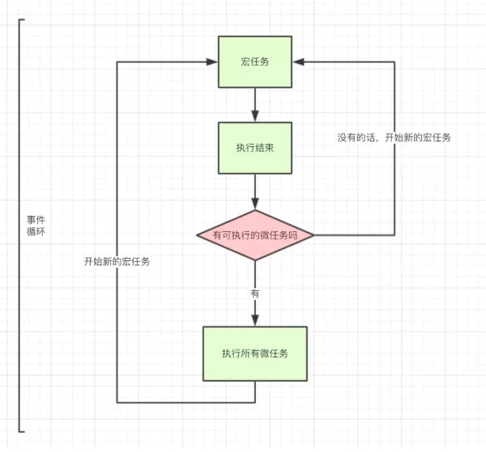

[TOC]

# JavaScript中异步原理的理解

> JavaScript 是单线程的，浏览器无论在什么时候都只且只有一个线程在运行JS。
>
> 能执行异步任务，是因为 JS 中存在事件循环（Event Loop）和任务队列（Task Queue）

* JS本身是单线程语言，所谓异步是依赖于浏览器或者操作系统等完成。JS 主线程拥有一个 执行栈 以及一个 任务队列，主线程会依次执行代码，当遇到函数时，会先将函数入栈，函数运行完毕后再将该函数出栈，直到所有代码执行完毕。
* 遇到异步操作（例如：setTimeout， AJAX）时，异步操作会由浏览器执行，浏览器会在这些任务完成后，将事先定义的回调函数推入 主线程 的 任务队列 中,当 主线程 的 执行栈 清空之后会读取 任务队列 中的回调函数，当 任务队列 被读取完毕之后，主线程接着执行，从而进入一个无限的循环，这就是事件循环.

**优点**：单线程不必理会线程同步这些复杂的问题，问题得到简化。

#### JavaScript的线程、事件循环、任务队列

##### 事件循环==Event Loop==

> JS 会创建一个类似于 while (true) 的循环，每执行一次循环体的过程称之为 Tick。每次 Tick 的过程就是查看是否有待处理事件，如果有则取出相关事件及回调函数放入执行栈中由主线程执行。待处理的事件会存储在一个任务队列中，也就是每次 Tick 会查看任务队列中是否有需要执行的任务。

##### 事件循环的执行顺序

- 首先执行同步代码，这属于宏任务
- 当执行完所有同步代码后，执行栈为空，查询是否有异步代码需要执行
- 执行所有微任务
- 当执行完所有微任务后，如有必要会渲染页面
- 然后开始下一轮 Event Loop，执行宏任务中的异步代码，也就是 setTimeout 中的回调函数

##### 任务队列==Task Queue==

> **任务队列：**异步操作会将相关回调添加到任务队列中。而不同的异步操作添加到任务队列的时机也不同，如 onclick, setTimeout, ajax 处理的方式都不同，这些异步操作是由浏览器内核的 webcore 来执行的，webcore 包含上图中的3种 webAPI，分别是 DOM Binding、network、timer模块。

　　**1. onclick：** 由浏览器内核的 DOM Binding 模块来处理，当事件触发的时候，回调函数会立即添加到任务队列中。

　　**2. setTimeout：** 由浏览器内核的 timer 模块来进行延时处理，当时间到达的时候，才会将回调函数添加到任务队列中。

　　**3. ajax：** 由浏览器内核的 network 模块来处理，在网络请求完成返回之后，才将回调添加到任务队列中。

> 《你不知道的 JavaScript》一书中，重新讲解了 ES6 新增的任务队列，和上面的任务队列略有不同，上面的任务队列书中称为事件队列。
>
> 上面提到的任务（事件）队列是在事件循环中的，事件循环每一次 tick 便执行上面所述的任务（事件）队列中的一个任务。而任务（事件）队列是只能往尾部添加任务。
>
> 而 ES6 中新增的任务队列是在事件循环之上的，事件循环每次 tick 后会查看 ES6 的任务队列中是否有任务要执行，也就是 ES6 的任务队列比事件循环中的任务（事件）队列优先级更高。
>
> 如 Promise 就使用了 ES6 的任务队列特性。

##### 微任务==microtask==和宏任务==macrotask== ^异步任务的两种分类^

> 一个浏览器环境只能有一个事件循环，而一个事件循环可以多个任务队列，每个任务都有一个任务源（Task source）

**宏任务：** 包括整体代码script，setTimeout，setInterval、I/O、UI rendering、setImmediate

**微任务：** Promise（这里指浏览器实现的原生 Promise）、Object.observe、MutationObserver、process.nextTick

> 在 ES6 规范中，微任务==microtask== 称为 jobs ，宏任务==macrotask== 称为 task
>
> 
>
> 不止一个消息队列，有==异步队列==和==事件队列==，而==事件队列==总是优先于==异步队列==被空闲下来的JS线程取用

**挂起任务时，JS 引擎会将所有任务按照类别分到这两个队列中；**

1. 首先在==宏任务==的队列（这个队列也被叫做 task queue）中取出第一个任务
2. 执行完毕后取出==微任务==队列中的所有任务顺序执行；之后再取==宏任务==，周而复始，直至两个队列的任务都取完。
3. script标签是一个==宏任务==，先执行一个==宏任务==，执行过程中遇到(setTimeout, setInterval, setImmediate等)则创建一个==宏任务==，遇到(process.nextTick, Promises等)创建一个==微任务==，这两个任务队列分别被挂起，执行栈为空时开始处理==宏任务==，完成后处理==微任务==，直到该==微任务==全部执行完，然后继续主线程调用栈.

**注意：** 每一次事件循环，只处理一个宏任务。待该 宏任务 完成后，所有的 微任务 会在同一次循环中处理。处理这些 微任务 时，还可以将更多的 微任务 入队，它们会一一执行，直到整个 微任务 队列处理完。

##### 宏任务和微任务之间的关系

##### 微任务快于宏任务？

> **错误**
>
> 因为宏任务中包括了 script ，浏览器会先执行一个宏任务，接下来有异步代码的话才会先执行微任务。

##### NodeJS的 宏任务 和 微任务 跟 浏览器环境的区别

执行的规则不同

**浏览器：** HTML5中定义的规范。

**node：** 由 Libuv库 实现。==Libuv 为 Node.js 提供了跨平台，线程池，事件池，异步 I/O 等能力==

> Libuv 本身就是异步和事件驱动的
>
> **Libuv库流程大体分为6个阶段：**
>
> timers，I/O callbacks，idle、prepare，poll，check，close callbacks

###### 一个异步 I/O 的大致实现流程

**1. 发起 I/O 调用**

* 用户通过 Javascript 代码调用 NodeJS 核心模块，将参数和回调传入核心模块

* NodeJS 核心模块将传入参数和回调封装为一个请求对象

* 将这个请求对象推入到I/O线程池中等待执行

* Javascript 发起的异步调用结束，Javascript 线程继续执行后续操作

**2. 执行回调**

* 异步任务完成之后，会将结果存放在请求对象的 result 属性上，并发出操作完成通知

* 每次事件循环时会检查 I/O 线程池中是否存在已经完成的 I/O 操作，如果有就将请求事件加入到I/O观察者队列当中（事件队列），之后当作事件处理

* 处理I/O观察者事件时，会将之前封装在请求对象中的回调函数取出，并将 result 参数传入执行，以完成 Javascript 回调的目的

> 因为 NodeJS 异步的天性，在处理并发 IO 的时候不会阻塞主线程，实际上这种异步是借助于多线程实现的，IO 任务完成之后排队等待主线程执行。
>
> 
>
> 如果 NodeJS 主线程在执行同步任务的时候遇到一些计算量非常大，或者执行循环太久，等非常耗时的操作的时候，就会导致后续的代码以及事件队列里已完成的 IO 任务迟迟得不到执行，严重拖垮 NodeJS 的性能。

#### 主线程==JS 只有一个线程，称之为主线程==

1. **事件循环是主线程中执行栈里的代码执行完毕之后，才开始执行的。**

2. **主线程中要执行的代码时间过长，会阻塞事件循环的执行，也就会阻塞异步操作的执行。**

3. **主线程中执行栈为空的时候（即同步代码执行完后），才会进行事件循环来观察要执行的事件回调，当事件循环检测到任务队列中有事件就取出相关回调放入执行栈中由主线程执行。**

#### 调用栈

> JS执行时会形成调用栈；
>
> 调用一个函数时，返回地址、参数、本地变量都会被推入栈中，如果当前正在运行的函数中调用另外一个函数，则该函数相关内容也会被推入栈，该函数执行完毕，则会被弹出调用栈，变量也随之弹出，由于复杂类型值存放于堆中，因此弹出的只是指针，他们的值依然在堆中，由GC决定回收。

##### 尾调用优化

​		某个函数的最后一步是调用另一个函数。由调用栈可知,调用栈中有a函数，如果a函数调用b函数，则b函数也随之入栈，此时栈中就会有两个函数，但是如果b函数是a函数最后一步，并且不需保留外层函数调用记录，即a函数调用位置变量等都不需要用到，则该调用栈中会只保留b函数

> **Tail call optimization**
>
> 只保留内层函数的调用记录。如果所有函数都是尾调用，那么完全可以做到每次执行时，调用记录只有一项，这将大大节省内存。

