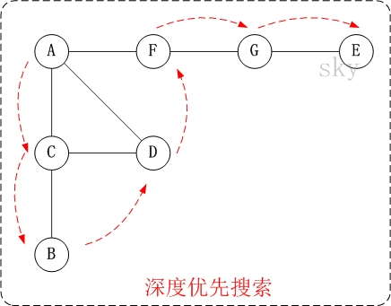
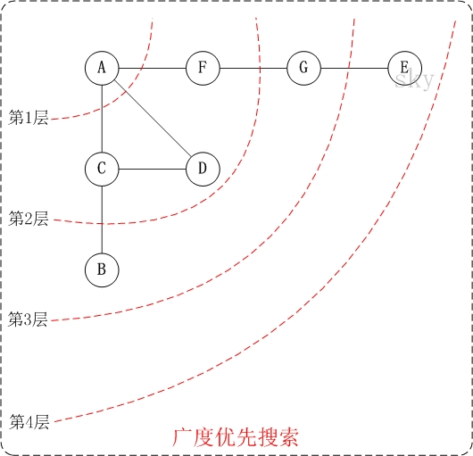

[TOC]

# JavaScript的深拷贝和浅拷贝

#### 浅拷贝

> 创建一个新对象，这个对象有着原始对象属性值的一份精确拷贝。如果属性是基本类型，拷贝的就是基本类型的值，如果属性是引用类型，拷贝的就是内存地址 ，所以如果其中一个对象改变了这个地址，就会影响到另一个对象。

##### 实现

```javascript
function clone(target) {
    let cloneTarget = {};
    for (const key in target) cloneTarget[key] = target[key];
    return cloneTarget;
};
// 创建一个新的对象，遍历需要克隆的对象，将需要克隆对象的属性依次添加到新对象上，返回
```

#### 深拷贝

> 将一个对象从内存中完整的拷贝一份出来,从堆内存中开辟一个新的区域存放新对象,且修改新对象不会影响原对象

##### JSON.parse(JSON.stringify())

##### 递归

```javascript
/* 如果是原始类型，无需继续拷贝，直接返回
如果是引用类型，创建一个新的对象，遍历需要克隆的对象，将需要克隆对象的属性执行深拷贝后依次添加到新对象上。*/
function clone(target) {
    if (typeof target === 'object') {
        let cloneTarget = {};
        for (const key in target) cloneTarget[key] = clone(target[key]);
        return cloneTarget;
    } else {
        return target;
    }
};
```

##### 深度优先遍历 Depth First Search

> 
>
> 搜索算法的一种，它沿着树的深度遍历树的节点，尽可能深地搜索树的分支。当节点v的所有边都已被探寻过，将回溯到发现节点v的那条边的起始节点。这一过程一直进行到已探寻源节点到其他所有节点为止，如果还有未被发现的节点，则选择其中一个未被发现的节点为源节点并重复以上操作，直到所有节点都被探寻完成。
> 简单的说，DFS就是从图中的一个节点开始追溯，直到最后一个节点，然后回溯，继续追溯下一条路径，直到到达所有的节点，如此往复，直到没有路径为止。



```javascript
let _toString = Object.prototype.toString;
let map = {
    array: 'Array',
    object: 'Object',
    function: 'Function',
    string: 'String',
    null: 'Null',
    undefined: 'Undefined',
    boolean: 'Boolean',
    number: 'Number'
}
function getType(obj){
    return _toString.call(obj).slice(8, -1)
}
function isTypeOf(obj, type){
    return map[type] && map[type] === getType(obj)
}

//深度克隆
//深度优先遍历
/**
 * 解决三个问题 递归问题  环状数据问题   边界处理（比如函数，Set等）
 */
const DFSdeepClone = function (obj, visitedArr = []){
    let _obj = {};
    if (isTypeOf(obj, 'array') || isTypeOf(obj, 'object')){
        let index = visitedArr.indexOf(obj);
        if (index > -1){
            _obj = visitedArr[index]
        } else {
            visitedArr.push(obj)
            for (let key in obj) {
                _obj[key] = DFSdeepClone(obj[key], visitedArr)
            }
        }
    } else if(isTypeOf(obj, 'function')){
        _obj = eval( '(' + obj.toString() + ')')//处理函数
    } else{
        _obj = obj;//处理原始值
    }
    return _obj;
}
let testObj = {
    a: 1,
    b: { c: 1, d: 2 },
    circle: null,
    e: function() { console.log(1); }
}
let cloneTestObj = DFSdeepClone(testObj);
let cloneTestObj2 = testObj;
console.log(cloneTestObj);

console.log('经过深度克隆后的更改');
cloneTestObj.b = {};//经过深度克隆后的更改
console.log(cloneTestObj);
console.log(testObj);
cloneTestObj2.b = {}; //引用的更改
console.log('引用的更改');
console.log(cloneTestObj2);
console.log(testObj);
//环状数据
let testCircle = {
    a: 1,
    b: { c: 1, d: 2, circle: null },
    e: function() { console.log(1); }
}
testCircle.b.circle = testCircle.b;
cloneTestCircle = DFSdeepClone(testCircle);//不处理环问题是会爆栈的 进入死循环
console.log(cloneTestCircle); 
```

##### 广度优先遍历 Breadth First Search

> 从根节点开始，沿着图的宽度遍历节点，如果所有节点均被访问过，则算法终止，BFS 同样属于盲目搜索，一般用队列数据结构来辅助实现BFS。



```javascript
let _toString = Object.prototype.toString;
let map = {
    array: 'Array',
    object: 'Object',
    function: 'Function',
    string: 'String',
    null: 'Null',
    undefined: 'Undefined',
    boolean: 'Boolean',
    number: 'Number'
}
function getType(obj){
    return _toString.call(obj).slice(8, -1)
}
function isTypeOf(obj, type){
    return map[type] && map[type] === getType(obj)
}

//广度优先深度克隆， 利用队列的方式实现
//利用copyObj建立一个与原对象相同的数据结构， 遇到可处理的值（比如原始值，函数，就处理后赋值到相应的节点下）
const BFSdeepClone = function (obj, visitedArr = []){
    let copyObj = {};
  	//进队列
    let sequeue = [obj];
    //同时copyObj也跟着一起进队列
    let copySequeue = [copyObj];
    while(sequeue.length){
        let _obj = sequeue.shift();
        let _copyObj = copySequeue.shift();
        if (isTypeOf(_obj, 'array') || isTypeOf(_obj, 'object')){
            for(item in _obj){
                let val = _obj[item];
                if (isTypeOf(val, 'object')){
                    let index = visitedArr.indexOf(val)
                    if (~index){
                        //是环形数据
                        _copyObj[item] = visitedArr[index];
                    } else {
                        //新的对象，给copyObj一个对应属性的空对象
                        sequeue.push(val);
                        _copyObj[item] = {};
                        copySequeue.push(_copyObj[item]);
                        visitedArr.push(val);
                    }
                } else if (isTypeOf(val, 'array')){
                    sequeue.push(val);
                    _copyObj[item] = [];
                    copySequeue.push(_copyObj[item])
                } else if(isTypeOf(val, 'function')){
                  	//处理函数
                    _copyObj[item] = eval( '(' + val.toString() + ')');
                } else {
                  	//处理原始值
                    _copyObj[item] = val;
                }
            }
        } else if(isTypeOf(obj, 'function')){
          	//处理函数
            _copyObj = eval( '(' + _obj.toString() + ')');
        } else{
          	//处理原始值
            _copyObj = _obj;
        }
    }
    return copyObj;
}

let testObj = {
    a: 1,
    b: { c: 1, d: 2 },
    circle: null,
    e: function() { console.log(1); }
}
let cloneTestObj = BFSdeepClone(testObj);
let cloneTestObj2 = testObj;
console.log(cloneTestObj);

//环状数据
let testCircle = {
    a: 1,
    b: { c: 1, d: 2, circle: null },
    e: function() { console.log(1); }
}
testCircle.b.circle = testCircle.b;
cloneTestCircle = BFSdeepClone(testCircle);//不处理环问题是会爆栈的 进入死循环
console.log(cloneTestCircle);
```

[原文链接](https://www.cnblogs.com/chenlei987/p/11304239.html)

#### 使用Proxy实现一个高性能的深拷贝

```javascript
const MY_IMMER = Symbol('my-immer1')
const isPlainObject = value => {
  if (!value || typeof value !== 'object' || {}.toString.call(value) != '[object Object]') return false;
  let proto = Object.getPrototypeOf(value)
  if (proto === null) return true;
  let Ctor = hasOwnProperty.call(proto, 'constructor') && proto.constructor
  return (
    typeof Ctor == 'function' &&
    Ctor instanceof Ctor &&
    Function.prototype.toString.call(Ctor) ===
      Function.prototype.toString.call(Object)
  )
}

const isProxy = value => !!value && !!value[MY_IMMER]

function produce(baseState, fn) {
  const proxies = new Map()
  const copies = new Map()

  const objectTraps = {
    get(target, key) {
      if (key === MY_IMMER) return target
      const data = copies.get(target) || target
      return getProxy(data[key])
    },
    set(target, key, val) {
      const copy = getCopy(target)
      const newValue = getProxy(val)
      // 这里的判断用于拿 proxy 的 target
      // 否则直接 copy[key] = newValue 的话外部拿到的对象是个 proxy
      copy[key] = isProxy(newValue) ? newValue[MY_IMMER] : newValue
      return true
    }
  }

  const getProxy = data => {
    if (isProxy(data)) return data;
    if (isPlainObject(data) || Array.isArray(data)) {
      if (proxies.has(data)) return proxies.get(data);
      const proxy = new Proxy(data, objectTraps)
      proxies.set(data, proxy)
      return proxy;
    }
    return data;
  }

  const getCopy = data => {
    if (copies.has(data)) return copies.get(data);
    const copy = Array.isArray(data) ? data.slice() : { ...data }
    copies.set(data, copy)
    return copy
  }

  const isChange = data => {
    if (proxies.has(data) || copies.has(data)) return true
  }

  const finalize = data => {
    if (isPlainObject(data) || Array.isArray(data)) {
      if (!isChange(data)) return data;
      const copy = getCopy(data);
      Object.keys(copy).forEach(key => {
        copy[key] = finalize(copy[key]);
      })
      return copy;
    }
    return data;
  }

  const proxy = getProxy(baseState);
  fn(proxy);
  return finalize(baseState);
}

const state = {
  info: {
    name: 'yck',
    career: {
      first: {
        name: '111'
      }
    }
  },
  data: [1]
}

const data = produce(state, draftState => {
  draftState.info.age = 26;
  draftState.info.career.first.name = '222';
})

console.log(data, state);
console.log(data.data === state.data);
```

#### lodash

使用lodash的[baseClone](https://github.com/lodash/lodash/blob/master/.internal/baseClone.js)方法