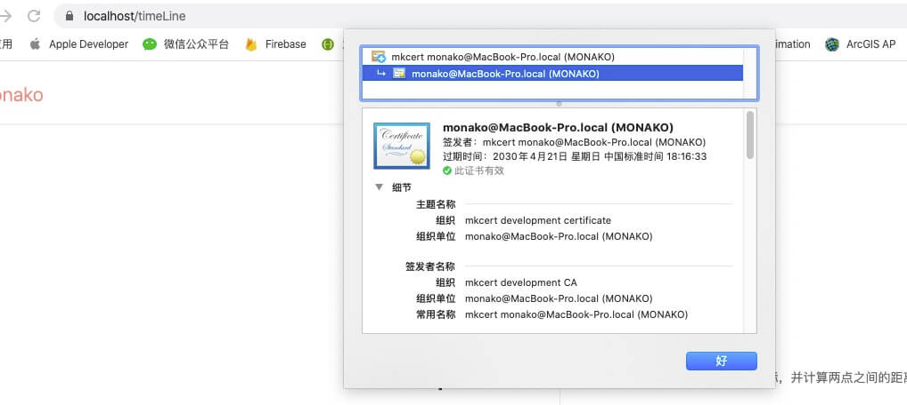

# 使用Mkcert签发本地证书

> [mkcert](https://github.com/FiloSottile/mkcert) 是由 [Filippo Valsorda](https://blog.filippo.io/hi/) 使用 ==Go==语言开源的一款零配置搭建本地证书服务的工具，它可以兼容`Window, Linux, macOS`等多种开发平台，省去了我们自签本地证书的繁琐步骤，从而让我们专注于开发。



#### 安装Mkcert

**1. macOS** : 使用[Homebrew](https://brew.sh/)安装`mkcert`：

```shell
brew install mkcert
brew install nss
```

**2. Windows**

*  **使用 powershell 安装 Chocolatey**

```powershell
Set-ExecutionPolicy Bypass -Scope Process -Force; iex ((New-Object System.Net.WebClient).DownloadString('https://chocolatey.org/install.ps1'))
```

* **使用 Chocolatey 安装 mkcert**

```powershell
choco install mkcert
```

**3. Linux**

```shell
# 更新软件源 
sudo apt update
# 安装证书数据库工具certutil
sudo apt install libnss3-tools # ubuntu
sudo yum install nss-tools # centos
# 安装包管理工具 linuxbrew-wrapper
sudo yum install linuxbrew-wrapper # centos
# 使用brew安装mkcert
brew install mkcert
## 配置全局变量的PATH
PATH=$PATH:/home/linuxbrew/.linuxbrew/Cellar/mkcert/1.2.0/bin
```

#### 生成本地CA证书

**1. 生成根证书** : mkcert -install

> 根证书用来充当第三方证书签发机构，类似于==Symantec==这种机构，为网站签发CA证书。因为证书也可以伪造，所以浏览器需要验证证书的有效性，证书有效之后才可以进行`https`连接，而第三方签发机构提供证书的可信度验证。
>
> ==rootCA==文件就是告诉浏览器我们自签的证书是真实有效的，接下来我们签发的本地证书都离不开==rootCA==

```shell
(ﾉ>ω<)ﾉ $ mkcert -install
Using the local CA at "/Users/monako/Library/Application Support/mkcert" ✨
The local CA is already installed in the system trust store! 👍
The local CA is now installed in the Firefox trust store (requires browser restart)! 🦊
```

**2. 签发本地证书**

> 根证书生成之后就可以签发本地证书了，生成的证书存放路径就是命令的执行路径
>
> Mkcert会自动把证书加入系统认证，操作系统和浏览器可以直接识别

```shell
(ﾉ>ω<)ﾉ $ mkcert localhost "*.localhost.org" myapp.dev localhost 127.0.0.1 ::1
Using the local CA at "/Users/monako/Library/Application Support/mkcert" ✨

Created a new certificate valid for the following names 📜
 - "localhost"
 - "*.localhost.org"
 - "myapp.dev"
 - "localhost"
 - "127.0.0.1"
 - "::1"

Reminder: X.509 wildcards only go one level deep, so this won't match a.b.localhost.org ℹ️

The certificate is at "./localhost+5.pem" and the key at "./localhost+5-key.pem" ✅
```

#### 可移植的解决方案

> 将自签证书(包括公钥和私钥)以及根证书的公钥拷贝给其它用户，修改`$CAROOT`环境变量，指定`mkcert`寻找根证书的路径

* **Linux / MacOS**

```shell
export CAROOT="/home/..."
```

* **Window** : 设置系统的环境变量，变量名为 **CAROOT**

* **执行 mkcert -install**

```shell
The local CA is now installed in the system trust store! ⚡️
The local CA is now installed in the Firefox and/or Chrome/Chromium trust store (requires browser restart)! 🦊
```

