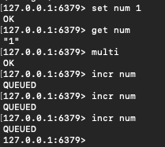

# Redis的基本使用

#### 1. 编译

```shell
cd redis/
make
make install
```

#### 2. 配置环境变量

```bash
vim /etc/profile
...
export PATH=${PATH}:/usr/local/redis/src
```

### 3. 更新环境变量

```bash
source /etc/profile
```

#### 4. 修改配置，默认启动就后台运行

```shell
# 找到redis.conf 并修改 daemonize no 为 daemonize yes 
vim redis/redis.conf
```

#### 5. 启动 redis 服务

```shell
redis-server redis/redis.conf
```

#### 6. 基础使用

```shell
# 进入客户端
redis-cli
# 设置 key value
set key value
# 获取 value
get key
# 获取 key
get keys
# 删除
del key
```

#### 7. 事务

__1. 在窗口1开启事务，多次累加数据__



__2. 在窗口2中获取值__


__3. 在窗口1中提交事物__

回滚：discard


__4. 在窗口2中获取值__


